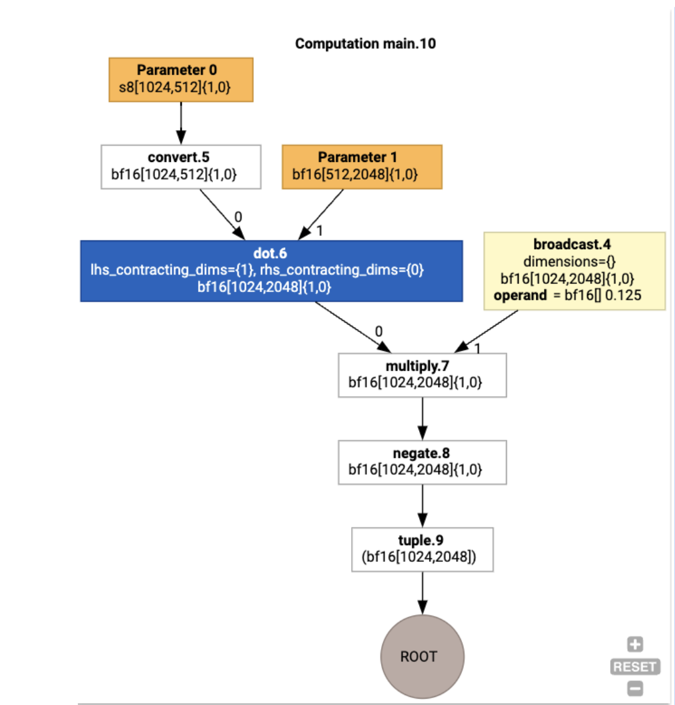
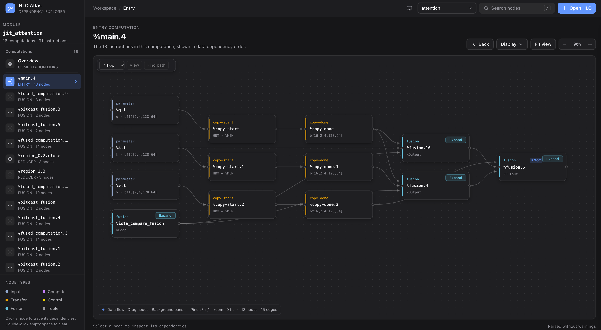
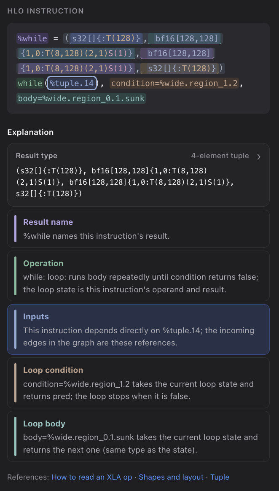
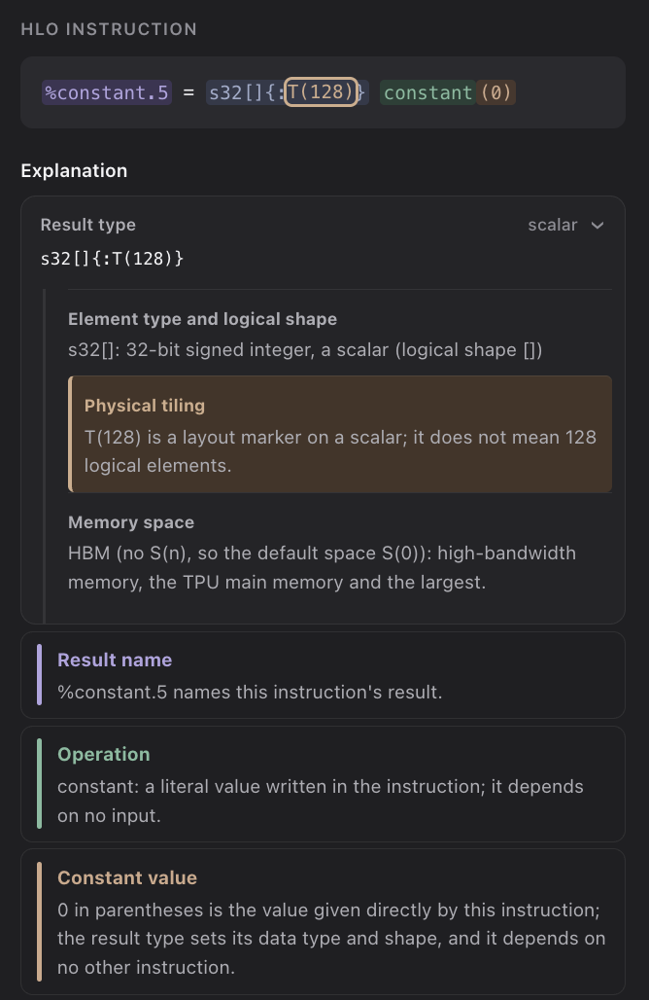
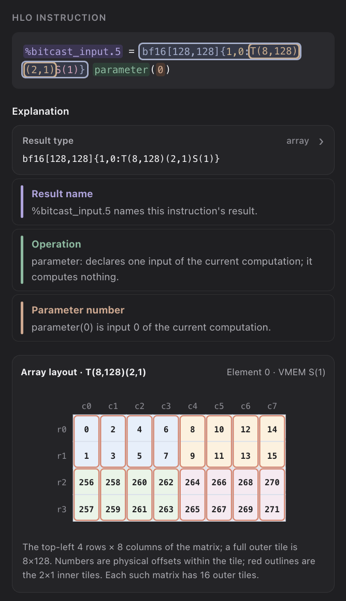

# HLO Visualizer - explore and understand XLA HLO

Interactive viewer for XLA HLO text, such as the HLO that JAX produces on TPU.

The same app now has an [LLO Visualizer](?view=llo) for TPU backend instruction dumps. It shows scheduled VLIW bundles by hardware unit, or source-order instructions in earlier LLO passes. Click an instruction to inspect its text, register inputs and users, and referenced allocations. You can paste a dump, choose a local file, or drop one onto the page; parsing runs in the browser.

**Open it here: https://www.junyi.dev/hlo-visualizer/**

<table>
  <tr>
    <th>XLA's built-in HLO graph</th>
    <th>HLO Visualizer</th>
  </tr>
  <tr>
    <td width="50%"></td>
    <td width="50%"></td>
  </tr>
</table>

<sub>Left image: from the <a href="https://openxla.org/xla/gpu_architecture">XLA GPU architecture overview</a>, OpenXLA, licensed under <a href="https://creativecommons.org/licenses/by/4.0/">CC BY 4.0</a>.</sub>

## Use it

1. Pick a module from **Examples**, or click **Open HLO** to paste text or choose a `.hlo` / `.txt` file.
2. Click a node. The inspector explains the instruction piece by piece.

## What you can see

- A plain-language explanation of every part of an instruction
- Where each value lives on TPU (HBM, VMEM, SMEM, …)
- Data and control dependencies between instructions

<table>
  <tr>
    <td width="33%"></td>
    <td width="33%"></td>
    <td width="33%"></td>
  </tr>
  <tr>
    <td>Every part of an instruction, explained</td>
    <td>Types and layouts, layer by layer</td>
    <td>TPU array tiling, drawn out</td>
  </tr>
</table>

## Get HLO from JAX

```python
lowered = jax.jit(f).lower(*args)
print(lowered.compile().as_text())                    # compiled HLO, with memory placement
print(lowered.as_text(dialect="hlo", debug_info=True)) # HLO before XLA optimizations
```

Output from XLA's `--xla_dump_to` also works.

## Get LLO from TPU compilation

For libtpu versions that support the Jellyfish LLO dumper, set these flags before importing JAX:

```sh
LIBTPU_INIT_ARGS="--xla_jf_dump_to=/tmp/llo --xla_jf_dump_llo_text=true" python your_program.py
```

Open a dumped LLO pass text file or `*-final_bundles.txt` in the [LLO view](?view=llo). This uses a separate dump directory from HLO's `--xla_dump_to`. LLO text is backend-specific and can vary by libtpu version; unknown instructions remain visible with their original text.

### Offline v6e examples

The LLO view includes one real final-bundle backend program for each of the 21 JAX examples, compiled for both **v6e:1** and **v6e:2x2** with JAX 0.11.2 and libtpu 0.0.48. Choose one from **Examples**, or link to one with [`?view=llo&example=v6e-1/mlp`](?view=llo&example=v6e-1/mlp); the initial screen remains an illustrative excerpt. The selected files and their source program names are in `examples/llo-v6e-1/` and `examples/llo-v6e-2x2/`. The two `examples/llo-v6e-*-full.tar.gz` archives contain **all** final-bundle programs, matching HLO text from the same offline compilation, and a manifest.

No TPU hardware was used. The compiler ran in a Linux x86_64 Docker container with a virtual topology. On Apple Silicon, Docker's default x86_64 translation lacked AVX, so we ran the container's Python through `qemu-x86_64-static -cpu max`. To reproduce inside a Linux x86_64 environment with `jax[tpu]==0.11.2` installed:

```sh
TPU_OFFLINE_TOPOLOGY=v6e:1 LLO_DUMP_DIR=/tmp/llo-v6e-1 \
LIBTPU_INIT_ARGS="--xla_jf_dump_to=/tmp/llo-v6e-1 --xla_jf_dump_llo_text=true --xla_jf_dump_llo_pass_label_regex=final_bundles" \
python scripts/dump_hlo.py /tmp/build-v6e-1
python scripts/select_llo_examples.py /tmp/build-v6e-1 examples/llo-v6e-1
```

Repeat with `v6e:2x2` and separate output paths. The script maps `v6e:1` to libtpu's `v6e:1x1` topology with `chips_per_host_bounds=(1,1,1)`; libtpu 0.0.48 rejects the literal `v6e:1` name. The 2x2 case replicates the existing single-device examples across four virtual devices. `pallas_add` and `collectives` retain their single-device behavior within that slice.

## Examples

The bundled examples are 21 small JAX programs (attention, MLP, convolution, while loops, scatter, sort, FFT, Pallas, …) compiled on a TPU v6e, each before and after optimization. Link to one directly, for example [`?example=attention.after`](https://www.junyi.dev/hlo-visualizer/?example=attention.after).
